# **Finding Lane Lines on the Road**

## Writeup

---

**Finding Lane Lines on the Road**

The goals / steps of this project are the following:
* Make a pipeline that finds lane lines on the road
* Reflect on your work in a written report

[//]: # (Image References)

[image1]: ./test_images/solidWhiteCurve.jpg "RGB"

---

### Reflection

### 1. Describe your pipeline. As part of the description, explain how you modified the draw_lines() function.

Example of an original RGB image is like this:

My pipeline in **P1.ipynb** consisted of 5 steps:
1. Convert the image to grayscale

2. Apply Gaussian smoothing
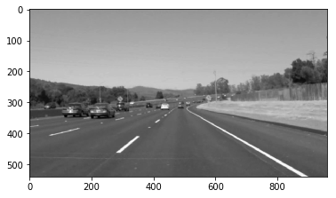

3. Apply Canny edge detection (the output are points that lie on edges)
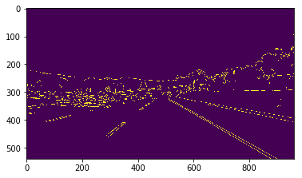

4. Select the edges in the region of interest
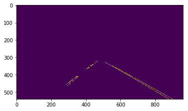

5. Use Hough transform to find line segments from these points. Then derive 2 solid lane lines from these segments and draw them on a black 3-channel image.
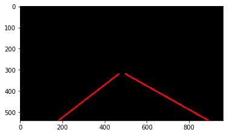

6. Finally, overlay the image from previous step on the original image using a weighted sum
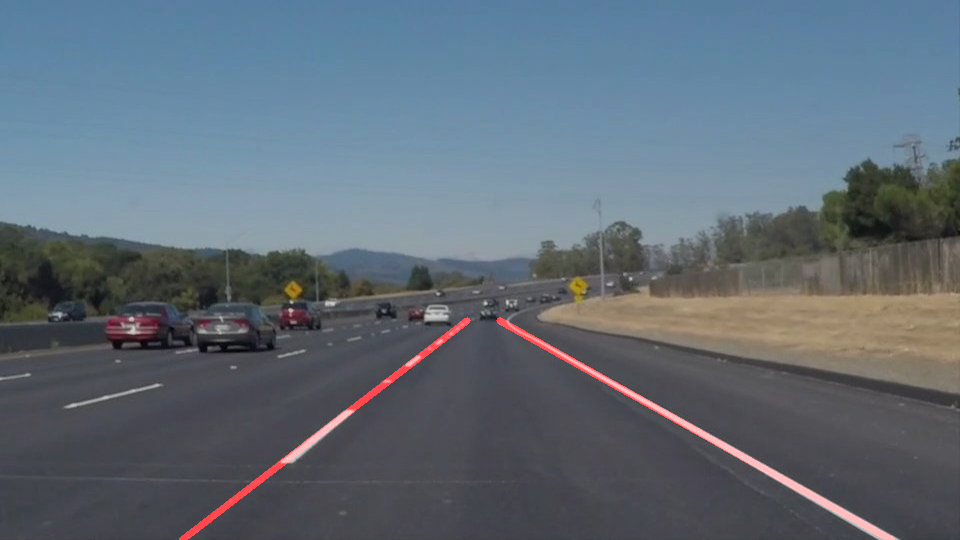

In step 5, in order to draw a single line on the left and right lanes, I modified the draw_lines() function into the **draw_two_lines()** function. Here are the steps in the new function:
- Identify segments belonging to the left lane vs those to the right one. Any segments that have both x-coordinates less than half the width of the image are considered left segments, while those greater than half the width are the right segments.
- Using linear regression, fit a line on all the segment points on the left. The fitting is weighted by the lengths of the segments. The output will give a single left lane line. Do similarly to the segment points on the right to get a single right lane line.
- Find the intersecting points between the 2 lane lines in the previous step with the bounding polygon, which represents the region of interest. Two horizontal lines y=y1 and y=y2 which make up the polygon can be used (y2 is the bottom of the image, while y1 is a selected value about the middle height of the image). This will give 2 single, solid left and right segments that span from the bottom of the image to the top of the region of interest.

With the above approach, all the images were marked correctly with 2 solid left and right lane lines:
* solid white curve:

* solid white right:
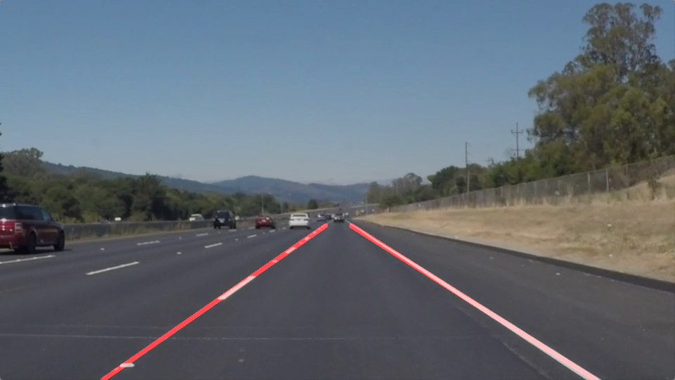
* solid yellow curve:
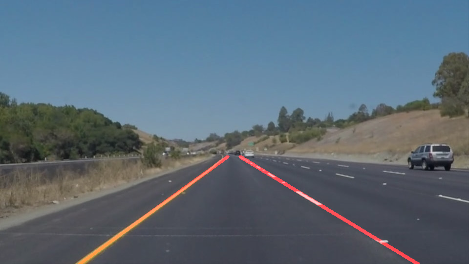
* solid yellow curve 2:
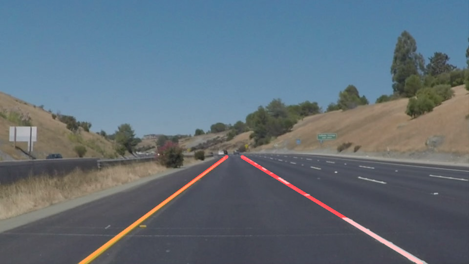
* solid yellow left:
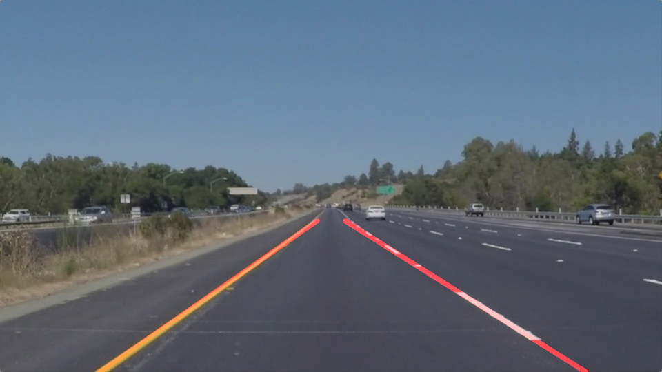
* white car lane switch:
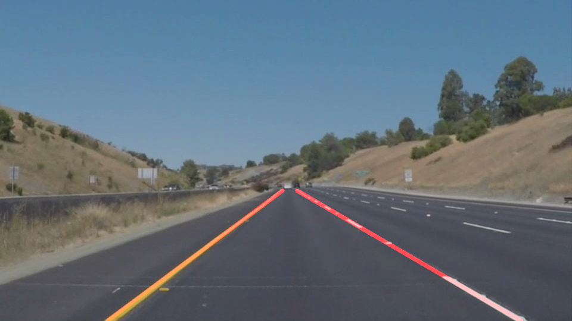

In **P1.ipynb**, I straight-away applied this technique onto the video files **solidWhiteRigth.mp4** and **solidYellowLeft.mp4**. The two lane lines were rendered farely well throughout both videos. Though, the lines appeared a bit jumpy at times.

However, when applied on the challenge video, it completely failed to detect the lanes.  

By looking at the outputs generated at different steps in the pipeline, it was found that Canny edge detection picked up more than just the lane lines:
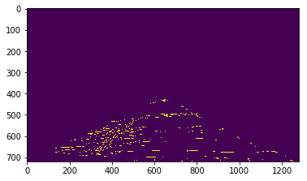

This is most likely due to the contrast level, brightness and also content (nearby trees, cars) in this video are different from the previous two.

#### P1-Challenge-Attempt1.ipynb

After some research, I learnt that grayscale transform may not be robust enough to help Canny algorithm in the case of the challenge video. A solution was to transform the RGB image into Hue, Saturation & Luminance (HSL) color space instead of grayscale, and select the yellow and white color lane lines using cv2.inRange() function.

In addition, instead of the linear regression technique, a commonly used approach to forming a single line from multiple Hough line segments is to calculate the length-weighted average of slopes and length-weighted average of intercepts of these segments as the slope and intercept, respectively, of the single line.

What is more, instead of using half of the image width to split the left and right lines, as in **p1.ipynb**, another way is to use the sign of the *slope = (y2 - y1) / (x2 - x1)*

Another technique was used to reduce the jittering effect and improve line detection in the videos. When iterating through the frames of a video, lines found in the previous 9 frames were retained and combined with those detected in the latest frame. The average values over these 10 frames were used as the values of lines for this latest frame.

The above techniques were used in this notebook. The result was that in the first two videos, the lane lines were detected farely accurately. In the challenge video, the detection was good in the sense that the main direction of the lines was detected reasonably well. However, the current implementation failed to draw correctly the smooth curve at the end of the lines. I consider this issue is to be solved only by using more advanced techniques, as here only straight lines can be detected.
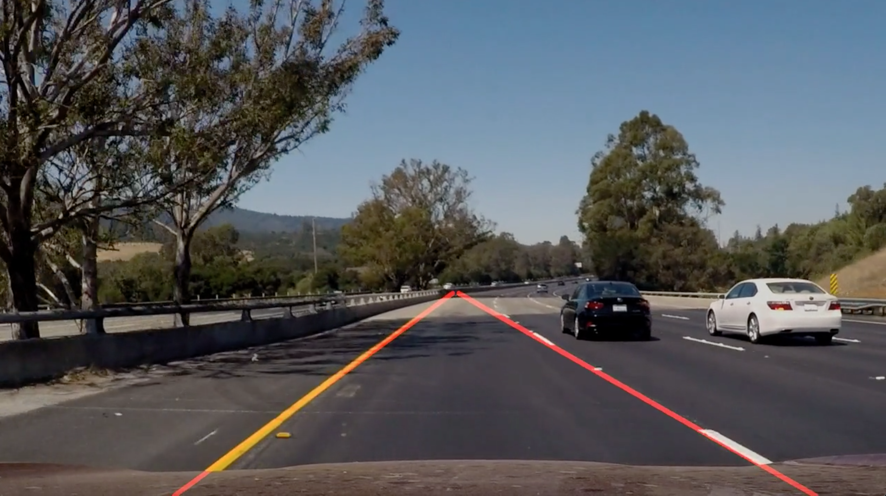

#### P1-Challenge-Attempt2.ipynb

Finally, I still observed that there were some jumpy movements of the lines in the videos produced by the implementation in **P1-Challenge-Attempt1.ipynb**. In this notebook, I reused two approaches that were applied in **P1.ipynb**:
* Use half width of the image as a threshold to determin left and right lines
* Use length-weighted linear regression to determine the line from multiple Hough line segments. (Before taking average over last 10 frames)

It was observed that the drawing of lines in the videos appeared to be a bit smoother. Hence, this notebook is used to produced the final outputs in this project.

### 2. Identify potential shortcomings with your current pipeline

One potential shortcoming would be what would happen when the road gets a lot more curvy. Using techniques that are limited to straight lines only may not be good enough.

Another shortcoming could be that, as seen in the challenge video, the quality and condition of the video (contrast, brightness, content...) could affect the effectiveness of the pipeline. Techniques that are more robust to noisy environment are required.

Finally, I feel that there are quite a number of parameters to tune and currently a fixed set of values are used. Whether the same set of values can lead to similar good results on other images and videos is a big question mark.

### 3. Suggest possible improvements to your pipeline

A possible improvement would be to use non-linear regression techniques to fit smooth curves to the edge points.

Perhaps using an ensemble approaches, with multiple pipelines, each uses a different color space, color selection scheme, shape of region of interest, line fitting techniques etc..., which are combined at the end to produce what could be predefined as a good representation of lane lines on the road.
